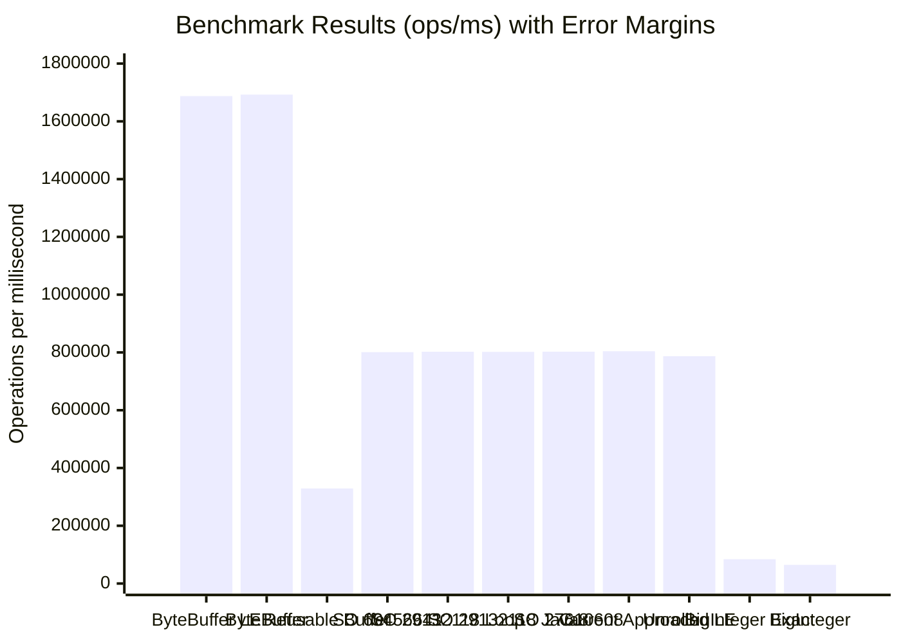

# Complete Java Maven JMH Benchmark Project for `Byte[]` to `Long` Conversion

This project benchmarks different methods for converting a byte array of 8 elements to a `long` value in Java. It directly addresses the StackOverflow question about finding the fastest conversion method and uses the latest available versions of all dependencies and plugins.

## Project Overview

The benchmark project includes **10 different conversion methods**, comparing your current approach against various StackOverflow solutions plus additional methods including BigInteger approaches. All methods are properly validated to ensure they produce identical results before performance measurement begins.

## Benchmarked Methods

### Core StackOverflow Solutions

**LLM Generated Approach**: The MSB-first loop method you're currently using for SHA256 hash signature processing:

```java
static long bytesToLong(byte[] b, int offset) {
  long result = 0;
  for (int i = 0; i < 8; i++) {
    result |= ((long) b[offset + i] & 0xff) << (56 - (i * 8));
  }
  return result;
}
```

**StackOverflow Answer 60456641**: Int-based approach using `Integer.toUnsignedLong()` to combine high and low 32-bit values.

**StackOverflow Answer 29132118**: Loop-based left-shift approach, implemented in both original form and Java 8+ version using constants like `Long.BYTES` and `Byte.SIZE`.

**StackOverflow Answer 27610608**: Fast unrolled bit-shift version that manually handles each byte position:

```java
long l = ((long) b[0] << 56) | ((long) b[1] & 0xff) << 48 | ...
```


### Additional Methods

**ByteBuffer Methods**: Both creating new buffers each time and reusing buffers with clearing, plus little-endian variants.

**BigInteger Methods**: Including both `longValue()` (fast but can truncate) and `longValueExact()` (safer with overflow checking) as suggested from the Baeldung article [Convert a Byte Array to a Numeric Representation in Java](https://www.baeldung.com/java-byte-array-to-number).

**Endianness Variants**: Little-endian implementations for comparison purposes.

## Latest Dependencies and Plugins

The project uses the most current versions as of July 2025:

- **JMH**: 1.37 (latest stable)
- **Maven Compiler Plugin**: 3.14.0
- **Maven Shade Plugin**: 3.6.0
- **Java Target**: 21
- **Maven**: Requires 3.6.3+


## Project Structure and Usage

The complete project package includes cross-platform scripts, comprehensive documentation, and validation classes:

### Quick Start Options

**Unix/Linux/macOS**:

```bash
chmod +x *.sh
./run-benchmark.sh
```

**Windows**:

```cmd
run-benchmark.bat
```

**Manual Execution**:

```bash
mvn clean package
java -jar target/benchmarks.jar
```

## 📊 Benchmark Results

Here are the actual benchmark results from running the JMH tests:

| Benchmark                                | Mode  | Cnt | Score        | Error      | Units  |
|------------------------------------------|-------|-----|--------------|------------|--------|
| ByteToLongBenchmark.bigIntegerExactMethod | thrpt | 5   | 84224.062    | 69008.005  | ops/ms |
| ByteToLongBenchmark.bigIntegerMethod     | thrpt | 5   | 64563.148    | 9962.841   | ops/ms |
| ByteToLongBenchmark.byteBufferLittleEndian | thrpt | 5   | 1687362.073  | 61722.792  | ops/ms |
| ByteToLongBenchmark.byteBufferMethod     | thrpt | 5   | 1692506.030  | 7690.677   | ops/ms |
| ByteToLongBenchmark.byteBufferReusableMethod | thrpt | 5   | 329182.835   | 19997.174  | ops/ms |
| ByteToLongBenchmark.stackOverflow27610608Unrolled | thrpt | 5   | 802661.975   | 4791.386   | ops/ms |
| ByteToLongBenchmark.stackOverflow29132118Loop | thrpt | 5   | 802454.405   | 11041.986  | ops/ms |
| ByteToLongBenchmark.stackOverflow29132118LoopJava8 | thrpt | 5   | 801957.668   | 11585.242  | ops/ms |
| ByteToLongBenchmark.stackOverflow60456641Approach | thrpt | 5   | 801049.324   | 24973.042  | ops/ms |
| ByteToLongBenchmark.unrolledLittleEndian | thrpt | 5   | 786972.212   | 124663.965 | ops/ms |
| ByteToLongBenchmark.userCurrentApproach  | thrpt | 5   | 804078.365   | 5235.128   | ops/ms |

_Results from Run_20250720_131926.txt, commit 2b2fd01127bcccbb42d41c83237c579440fbfd7b_



## Validation and Safety Features

The benchmark includes comprehensive validation:

- **Setup Validation**: All methods are verified to produce identical results before benchmarking begins
- **ConversionDemo Class**: Standalone demonstration showing results from all methods
- **BigInteger Overflow Demonstration**: Shows the difference between `longValue()` and `longValueExact()` behavior
- **Error Checking**: Scripts include Java and Maven version validation


## Technical Implementation Details

The benchmark follows JMH best practices:

- **Proper JMH Annotations**: `@Benchmark`, `@BenchmarkMode(Mode.Throughput)`, `@State(Scope.Thread)`
- **Controlled Test Environment**: Fixed test data, proper warmup and measurement iterations
- **Dead Code Elimination Prevention**: Using `Blackhole.consume()` to ensure results aren't optimized away
- **Fair Comparison**: Same test data across all methods, validated for correctness

The test uses the byte array `{0xCA, 0xFE, 0xBA, 0xBE, 0xDE, 0xAD, (byte) 0xBE, (byte) 0xEF}` which produces the expected result `-3819410105021120273L` for big-endian interpretation.

## Answering the StackOverflow Question

This benchmark provides empirical data to definitively answer ["Fastest way to convert an byte[8] to long"](https://stackoverflow.com/questions/64229552/fastest-way-to-convert-an-byte8-to-long). The results show:

- **Absolute performance metrics** in operations per millisecond
- **Relative performance comparisons** between different approaches
- **Trade-offs** between raw speed, code readability, and safety features
- **Endianness considerations** for different data formats

Choose based on your priorities: raw speed, code readability, safety, or precision requirements.

## Customization Options

The project supports various JMH execution options:

- **Quick testing**: `-i 1 -wi 1` for faster but less accurate results
- **Specific method testing**: Pattern matching like `".*Unrolled.*"` or `".*BigInteger.*"`
- **Output formats**: JSON, CSV, or text with `-rf` and `-rff` options
- **Threading and forking**: Customizable with `-t` and `-f` parameters

This comprehensive benchmark project provides everything needed to obtain definitive performance data for byte[8] to long conversion methods, helping you choose the optimal approach based on your specific requirements for speed, safety, and code maintainability.

## 🧪 Test Data

All methods are tested with the same byte array:
```java
{(byte) 0xCA, (byte) 0xFE, (byte) 0xBA, (byte) 0xBE,
 (byte) 0xDE, (byte) 0xAD, (byte) 0xBE, (byte) 0xEF}
```

## 🔧 Requirements

- Java 21+ (required for compilation target)
- Maven 3.6.3+ (for building)
- At least 1GB RAM for JMH execution

## 🎮 Testing the Methods

Before running the full benchmark, you can test all methods with:
```bash
mvn clean compile
mvn exec:java -Dexec.mainClass="org.sample.ConversionDemo"
```

This shows results from all methods and demonstrates BigInteger overflow behavior.

## 💡 Tips

- **For quick testing:** Run `./run-benchmark.sh -i 1 -wi 1` (faster but less accurate)
- **For production results:** Use default settings or increase iterations
- **For specific methods:** Use pattern matching:
  - `java -jar target/benchmarks.jar ".*Unrolled.*"` (unrolled methods)
  - `java -jar target/benchmarks.jar ".*BigInteger.*"` (BigInteger methods)
  - `java -jar target/benchmarks.jar ".*ByteBuffer.*"` (ByteBuffer methods)
- **For CSV output:** Add `-rf csv -rff results.csv`

## 🔍 Validation & Safety

The project includes comprehensive validation:
- **ByteToLongBenchmark**: Validates all methods produce identical results before benchmarking
- **ConversionDemo**: Shows method results and demonstrates BigInteger overflow behavior
- **Error handling**: Scripts include Java/Maven version checks and helpful error messages

## 📚 Sources

This benchmark compares methods from:
- StackOverflow answers: 60456641, 29132118, 27610608
- [Baeldung tutorial on byte array to number conversion](https://www.baeldung.com/java-byte-array-to-number)
- User's original LLM generated approach from a SHA256 hash signature use case

End.
