# Complete Java Maven JMH Benchmark Project for `byte[8]` to `Long` Conversion

This project benchmarks different methods for converting a byte array of 8 elements to a `long` value in Java. It directly addresses the StackOverflow question [Fastest way to convert an byte[8] Array to long](https://stackoverflow.com/questions/64229552/fastest-way-to-convert-an-byte8-to-long) about finding the fastest conversion method and uses the latest available versions of all dependencies and plugins.

## The Definitive Answer

**Use `ByteBuffer.wrap(bytes).getLong()`** for `byte[8]` to `long` conversion:

```java
// Best approach - fast, safe, and clear
public static long bytesToLong(byte[] bytes) {
    return ByteBuffer.wrap(bytes).getLong();
}

// With explicit endianness (if needed)
public static long bytesToLongLittleEndian(byte[] bytes) {
    return ByteBuffer.wrap(bytes).order(ByteOrder.LITTLE_ENDIAN).getLong();
}
```

Because:

- ✅ **Fastest Performance**: 2x+ faster than any manual implementation
- ✅ **Thread Safe**: No shared state or synchronization issues
- ✅ **Endianness Control**: Explicit big-endian/little-endian handling
- ✅ **Maintainable**: Simple, readable, and relies on battle-tested JDK code

## 📊 Benchmark Results

The benchmark results show that `ByteBuffer` methods are significantly faster than any other approach. The following chart and table summarize the performance, with scores representing throughput in operations per millisecond (higher is better). The Java version used:

```shell
% java --version
java 24 2025-03-18
Java(TM) SE Runtime Environment (build 24+36-3646)
Java HotSpot(TM) 64-Bit Server VM (build 24+36-3646, mixed mode, sharing)
```

I am running on a MacBook M1 with 8GB RAM, macOS 15.5 (Sequoia). YMMV may vary based on your hardware and JVM settings. Yet the results are so convincing and best technique is so easy it would be very hard to beat.

Results from Run_20250720_131926.txt, commit 2b2fd01127bcccbb42d41c83237c579440fbfd7b are:

```mermaid
gantt
    title Benchmark Results (ops/ms) with Error Margins
    dateFormat X
    axisFormat %s

    section ByteBuffer
    ByteBuffer (BBB)       : 0, 1692506
    Error ±7691          : 1684815, 1700197
    ByteBuffer LE (BLE)    : 0, 1687362
    Error ±61723         : 1625639, 1749085
    Reusable Buffer (RBF)  : 0, 329183
    Error ±19997         : 309186, 349180

    section Manual Implementations
    Manual BE Loop (MBL)   : 0, 804078
    Error ±5235          : 798843, 809313
    Unrolled LE (ULE)      : 0, 786972
    Error ±124664        : 662308, 911636

    section Stack Overflow
    SO 27610608 (S27)      : 0, 802662
    Error ±4791          : 797871, 807453
    SO 29132118 Java8 (S29J): 0, 801958
    Error ±11585         : 790373, 813543
    SO 29132118 Loop (S29) : 0, 802454
    Error ±11042         : 791412, 813496
    SO 60456641 (S60)      : 0, 801049
    Error ±24973         : 776076, 826022

    section BigInteger
    BigInteger Exact (BIX) : 0, 84224
    Error ±69008         : 15216, 153232
    BigInteger (BIG)       : 0, 64563
    Error ±9963          : 54600, 74526
```



### Performance Ranking (Fastest to Slowest)

| Rank | Code | Description                               | Benchmark Method                    | Score (ops/ms) | Error (±) |
|------|------|-------------------------------------------|-------------------------------------|----------------|-----------|
| 1    | BBB  | ByteBuffer Big-Endian (New Buffer)        | `byteBufferMethod`                  | 1,692,506      | 7,691     |
| 2    | BLE  | ByteBuffer Little-Endian                  | `byteBufferLittleEndian`            | 1,687,362      | 61,723    |
| 3    | MBL  | Manual Big-Endian Loop                    | `manualBigEndianShiftLoop`          | 804,078        | 5,235     |
| 4    | S27  | Unrolled Big-Endian Shift (SO:27610608)   | `stackOverflow27610608Unrolled`     | 802,662        | 4,791     |
| 5    | S29  | Loop with Left Shift (SO:29132118)        | `stackOverflow29132118Loop`         | 802,454        | 11,042    |
| 6    | S29J | Loop with Left Shift, Java 8+ (SO:29132118) | `stackOverflow29132118LoopJava8`    | 801,958        | 11,585    |
| 7    | S60  | High/Low Int Approach (SO:60456641)       | `stackOverflow60456641Approach`     | 801,049        | 24,973    |
| 8    | ULE  | Unrolled Little-Endian Shift              | `unrolledLittleEndian`              | 786,972        | 124,664   |
| 9    | RBF  | Reusable ByteBuffer                       | `byteBufferReusableMethod`          | 329,183        | 19,997    |
| 10   | BIX  | BigInteger `longValueExact()`             | `bigIntegerExactMethod`             | 84,224         | 69,008    |
| 11   | BIG  | BigInteger `longValue()`                  | `bigIntegerMethod`                  | 64,563         | 9,963     |

The test uses the byte array `{0xCA, 0xFE, 0xBA, 0xBE, 0xDE, 0xAD, (byte) 0xBE, (byte) 0xEF}` which produces the expected result `-3819410105021120273L` for big-endian interpretation.

## Benchmark Method Implementations

Below are the code snippets for each benchmarked method, ordered by performance.

### 1. `byteBufferMethod` (BBB)

**Description**: Wraps the byte array in a new `ByteBuffer` and reads the `long` value. This is the fastest and recommended approach.
**Source**: Standard JDK

```java
private static long byteBufferMethod(byte[] bytes) {
    return ByteBuffer.wrap(bytes).order(ByteOrder.BIG_ENDIAN).getLong();
}
```

### 2. `byteBufferLittleEndian` (BLE)

**Description**: Same as the fastest method but specifies little-endian byte order.
**Source**: Standard JDK

```java
private static long byteBufferLittleEndian(byte[] bytes) {
    return ByteBuffer.wrap(bytes).order(ByteOrder.LITTLE_ENDIAN).getLong();
}
```

### 3. `manualBigEndianShiftLoop` (MBL)

**Description**: A manual loop that builds the `long` by shifting and OR-ing each byte from most-significant to least-significant.
**Source**: Manual Implementation

```java
private static long manualBigEndianShiftLoop(byte[] b, int offset) {
    long result = 0;
    for (int i = 0; i < 8; i++) {
        result |= ((long) b[offset + i] & 0xff) << (56 - (i * 8));
    }
    return result;
}
```

### 4. `stackOverflow27610608Unrolled` (S27)

**Description**: An unrolled version of the manual big-endian bit-shifting approach.
**Source**: [StackOverflow Answer 27610608](https://stackoverflow.com/a/27610608/5647659)

```java
private static long stackOverflow27610608Unrolled(byte[] b) {
    return ((long) b[0] << 56)
         | ((long) b[1] & 0xff) << 48
         | ((long) b[2] & 0xff) << 40
         | ((long) b[3] & 0xff) << 32
         | ((long) b[4] & 0xff) << 24
         | ((long) b[5] & 0xff) << 16
         | ((long) b[6] & 0xff) << 8
         | ((long) b[7] & 0xff);
}
```

### 5. `stackOverflow29132118Loop` (S29)

**Description**: A loop that left-shifts the result and ORs the next byte.
**Source**: [StackOverflow Answer 29132118](https://stackoverflow.com/a/29132118/5647659)

```java
private static long stackOverflow29132118Loop(byte[] b) {
    long result = 0;
    for (int i = 0; i < 8; i++) {
        result <<= 8;
        result |= (b[i] & 0xFF);
    }
    return result;
}
```

### 6. `stackOverflow29132118LoopJava8` (S29J)

**Description**: A slightly modernized version of the previous loop using `Long.BYTES` and `Byte.SIZE`.
**Source**: [StackOverflow Answer 29132118](https://stackoverflow.com/a/29132118/5647659)

```java
private static long stackOverflow29132118LoopJava8(byte[] b) {
    long result = 0;
    for (int i = 0; i < Long.BYTES; i++) {
        result <<= Byte.SIZE;
        result |= (b[i] & 0xFF);
    }
    return result;
}
```

### 7. `stackOverflow60456641Approach` (S60)

**Description**: Combines two 4-byte integers into a long.
**Source**: [StackOverflow Answer 60456641](https://stackoverflow.com/a/60456641/5647659)

```java
private static long stackOverflow60456641Approach(byte[] bytes, int offset) {
    return Integer.toUnsignedLong(bytesToInt(bytes, offset)) << Integer.SIZE |
           Integer.toUnsignedLong(bytesToInt(bytes, offset + Integer.BYTES));
}

private static int bytesToInt(byte[] bytes, int offset) {
    return (bytes[offset + Integer.BYTES - 1] & 0xFF) |
           (bytes[offset + Integer.BYTES - 2] & 0xFF) << Byte.SIZE |
           (bytes[offset + Integer.BYTES - 3] & 0xFF) << Byte.SIZE * 2 |
           (bytes[offset + Integer.BYTES - 4] & 0xFF) << Byte.SIZE * 3;
}
```

### 8. `unrolledLittleEndian` (ULE)

**Description**: An unrolled manual implementation for little-endian byte order.
**Source**: Manual Implementation
```java
private static long unrolledLittleEndian(byte[] b) {
    return ((long) b[0] & 0xff)
         | ((long) b[1] & 0xff) << 8
         | ((long) b[2] & 0xff) << 16
         | ((long) b[3] & 0xff) << 24
         | ((long) b[4] & 0xff) << 32
         | ((long) b[5] & 0xff) << 40
         | ((long) b[6] & 0xff) << 48
         | ((long) b[7] & 0xff) << 56;
}
```

### 9. `byteBufferReusableMethod` (RBF)

**Description**: Uses a pre-allocated, reusable `ByteBuffer`. Slower due to the overhead of state management (`clear`, `put`, `flip`).
**Source**: Standard JDK

```java
private long byteBufferReusableMethod(byte[] bytes) {
    reusableBuffer.clear();
    reusableBuffer.put(bytes);
    reusableBuffer.flip();
    return reusableBuffer.getLong();
}
```

### 10. `bigIntegerExactMethod` (BIX)

**Description**: Uses `BigInteger` and converts to a `long` with overflow checking. It is safer but much slower.
**Source**: [Baeldung Article](https://www.baeldung.com/java-byte-array-to-number)

```java
private static long bigIntegerExactMethod(byte[] bytes) {
    return new BigInteger(bytes).longValueExact();
}
```

### 11. `bigIntegerMethod` (BIG)

**Description**: Uses `BigInteger` but can truncate the value if it exceeds `Long.MAX_VALUE`. This is the slowest and potentially unsafe method.
**Source**: [Baeldung Article](https://www.baeldung.com/java-byte-array-to-number)

```java
private static long bigIntegerMethod(byte[] bytes) {
    return new BigInteger(bytes).longValue();
}
```

## Running The Suite

**Unix/Linux/macOS**:

```bash
chmod +x *.sh
./run-benchmark.sh
```

**Windows**:

```cmd
run-benchmark.bat
```

**Manual Execution**:

```bash
mvn clean package
java -jar target/benchmarks.jar
```

## References

1. **[SO 27610608](https://stackoverflow.com/a/27610608)**
    - Unrolled bit-shift implementation
2. **[SO 29132118](https://stackoverflow.com/a/29132118)**
    - Loop-based shifting
3. **[SO 60456641](https://stackoverflow.com/a/60456641)**
    - High/low int combination
4. **[Baeldung](https://www.baeldung.com/java-byte-array-to-number)**
    - `BigInteger.longValue()` implementation

End
