# Complete Java Maven JMH Benchmark Project for `Byte[]` to `Long` Conversion

This project benchmarks different methods for converting a byte array of 8 elements to a `long` value in Java. It directly addresses the StackOverflow question about finding the fastest conversion method and uses the latest available versions of all dependencies and plugins.

## Project Overview

The benchmark project includes **11 different conversion methods**, comparing various StackOverflow solutions against `ByteBuffer`, `BigInteger`, and manual bit-shifting approaches. All methods are properly validated to ensure they produce identical results before performance measurement begins.

## Benchmarked Methods

### Core StackOverflow Solutions

**LLM Generated Approach**: The MSB-first loop method:

```java
static long bytesToLong(byte[] b, int offset) {
  long result = 0;
  for (int i = 0; i < 8; i++) {
    result |= ((long) b[offset + i] & 0xff) << (56 - (i * 8));
  }
  return result;
}
```

**StackOverflow Answer 60456641**: Int-based approach using `Integer.toUnsignedLong()` to combine high and low 32-bit values.

**StackOverflow Answer 29132118**: Loop-based left-shift approach, implemented in both original form and Java 8+ version using constants like `Long.BYTES` and `Byte.SIZE`.

**StackOverflow Answer 27610608**: Fast unrolled bit-shift version that manually handles each byte position:

```java
long l = ((long) b[0] << 56) | ((long) b[1] & 0xff) << 48 | ...
```


### Additional Methods

**ByteBuffer Methods**: Both creating new buffers each time and reusing buffers with clearing, plus little-endian variants.

**BigInteger Methods**: Including both `longValue()` (fast but can truncate) and `longValueExact()` (safer with overflow checking) as suggested from the Baeldung article [Convert a Byte Array to a Numeric Representation in Java](https://www.baeldung.com/java-byte-array-to-number).

**Endianness Variants**: Little-endian implementations for comparison purposes.

## Latest Dependencies and Plugins

The project uses the most current versions as of July 2025:

- **JMH**: 1.37 (latest stable)
- **Maven Compiler Plugin**: 3.14.0
- **Maven Shade Plugin**: 3.6.0
- **Java Target**: 21
- **Maven**: Requires 3.6.3+

## Project Structure and Usage

The complete project package includes cross-platform scripts, comprehensive documentation, and validation classes:

### Quick Start Options

**Unix/Linux/macOS**:

```bash
chmod +x *.sh
./run-benchmark.sh
```

**Windows**:

```cmd
run-benchmark.bat
```

**Manual Execution**:

```bash
mvn clean package
java -jar target/benchmarks.jar
```

## 📊 Benchmark Results

The benchmark results show that `ByteBuffer` methods are significantly faster than any other approach. The following chart and table summarize the performance, with scores representing throughput in operations per millisecond (higher is better).

_Results from Run_20250720_131926.txt, commit 2b2fd01127bcccbb42d41c83237c579440fbfd7b_



```mermaid
gantt
    title Benchmark Results (ops/ms) with Error Margins
    dateFormat X
    axisFormat %s

    section ByteBuffer
    ByteBuffer (BBB)       : 0, 1692506
    Error ±7691          : 1684815, 1700197
    ByteBuffer LE (BLE)    : 0, 1687362
    Error ±61723         : 1625639, 1749085
    Reusable Buffer (RBF)  : 0, 329183
    Error ±19997         : 309186, 349180

    section Manual Implementations
    Manual BE Loop (MBL)   : 0, 804078
    Error ±5235          : 798843, 809313
    Unrolled LE (ULE)      : 0, 786972
    Error ±124664        : 662308, 911636

    section Stack Overflow
    SO 27610608 (S27)      : 0, 802662
    Error ±4791          : 797871, 807453
    SO 29132118 Java8 (S29J): 0, 801958
    Error ±11585         : 790373, 813543
    SO 29132118 Loop (S29) : 0, 802454
    Error ±11042         : 791412, 813496
    SO 60456641 (S60)      : 0, 801049
    Error ±24973         : 776076, 826022

    section BigInteger
    BigInteger Exact (BIX) : 0, 84224
    Error ±69008         : 15216, 153232
    BigInteger (BIG)       : 0, 64563
    Error ±9963          : 54600, 74526
```

### Performance Ranking (Fastest to Slowest)

| Rank | Code | Description                               | Benchmark Method                    | Score (ops/ms) | Error (±) |
|------|------|-------------------------------------------|-------------------------------------|----------------|-----------|
| 1    | BBB  | ByteBuffer Big-Endian (New Buffer)        | `byteBufferMethod`                  | 1,692,506      | 7,691     |
| 2    | BLE  | ByteBuffer Little-Endian                  | `byteBufferLittleEndian`            | 1,687,362      | 61,723    |
| 3    | MBL  | Manual Big-Endian Loop                    | `manualBigEndianShiftLoop`          | 804,078        | 5,235     |
| 4    | S27  | Unrolled Big-Endian Shift (SO:27610608)   | `stackOverflow27610608Unrolled`     | 802,662        | 4,791     |
| 5    | S29  | Loop with Left Shift (SO:29132118)        | `stackOverflow29132118Loop`         | 802,454        | 11,042    |
| 6    | S29J | Loop with Left Shift, Java 8+ (SO:29132118) | `stackOverflow29132118LoopJava8`    | 801,958        | 11,585    |
| 7    | S60  | High/Low Int Approach (SO:60456641)       | `stackOverflow60456641Approach`     | 801,049        | 24,973    |
| 8    | ULE  | Unrolled Little-Endian Shift              | `unrolledLittleEndian`              | 786,972        | 124,664   |
| 9    | RBF  | Reusable ByteBuffer                       | `byteBufferReusableMethod`          | 329,183        | 19,997    |
| 10   | BIX  | BigInteger `longValueExact()`             | `bigIntegerExactMethod`             | 84,224         | 69,008    |
| 11   | BIG  | BigInteger `longValue()`                  | `bigIntegerMethod`                  | 64,563         | 9,963     |

## Benchmark Method Implementations

Below are the code snippets for each benchmarked method, ordered by performance.

### 1. `byteBufferMethod` (BBB)

**Description**: Wraps the byte array in a new `ByteBuffer` and reads the `long` value. This is the fastest and recommended approach.
**Source**: Standard JDK

```java
private static long byteBufferMethod(byte[] bytes) {
    return ByteBuffer.wrap(bytes).order(ByteOrder.BIG_ENDIAN).getLong();
}
```

### 2. `byteBufferLittleEndian` (BLE)

**Description**: Same as the fastest method but specifies little-endian byte order.
**Source**: Standard JDK

```java
private static long byteBufferLittleEndian(byte[] bytes) {
    return ByteBuffer.wrap(bytes).order(ByteOrder.LITTLE_ENDIAN).getLong();
}
```

### 3. `manualBigEndianShiftLoop` (MBL)

**Description**: A manual loop that builds the `long` by shifting and OR-ing each byte from most-significant to least-significant.
**Source**: Manual Implementation

```java
private static long manualBigEndianShiftLoop(byte[] b, int offset) {
    long result = 0;
    for (int i = 0; i < 8; i++) {
        result |= ((long) b[offset + i] & 0xff) << (56 - (i * 8));
    }
    return result;
}
```

### 4. `stackOverflow27610608Unrolled` (S27)

**Description**: An unrolled version of the manual big-endian bit-shifting approach.
**Source**: [StackOverflow Answer 27610608](https://stackoverflow.com/a/27610608/5647659)

```java
private static long stackOverflow27610608Unrolled(byte[] b) {
    return ((long) b[0] << 56)
         | ((long) b[1] & 0xff) << 48
         | ((long) b[2] & 0xff) << 40
         | ((long) b[3] & 0xff) << 32
         | ((long) b[4] & 0xff) << 24
         | ((long) b[5] & 0xff) << 16
         | ((long) b[6] & 0xff) << 8
         | ((long) b[7] & 0xff);
}
```

### 5. `stackOverflow29132118Loop` (S29)

**Description**: A loop that left-shifts the result and ORs the next byte.
**Source**: [StackOverflow Answer 29132118](https://stackoverflow.com/a/29132118/5647659)

```java
private static long stackOverflow29132118Loop(byte[] b) {
    long result = 0;
    for (int i = 0; i < 8; i++) {
        result <<= 8;
        result |= (b[i] & 0xFF);
    }
    return result;
}
```

### 6. `stackOverflow29132118LoopJava8` (S29J)

**Description**: A slightly modernized version of the previous loop using `Long.BYTES` and `Byte.SIZE`.
**Source**: [StackOverflow Answer 29132118](https://stackoverflow.com/a/29132118/5647659)

```java
private static long stackOverflow29132118LoopJava8(byte[] b) {
    long result = 0;
    for (int i = 0; i < Long.BYTES; i++) {
        result <<= Byte.SIZE;
        result |= (b[i] & 0xFF);
    }
    return result;
}
```

### 7. `stackOverflow60456641Approach` (S60)

**Description**: Combines two 4-byte integers into a long.
**Source**: [StackOverflow Answer 60456641](https://stackoverflow.com/a/60456641/5647659)

```java
private static long stackOverflow60456641Approach(byte[] bytes, int offset) {
    return Integer.toUnsignedLong(bytesToInt(bytes, offset)) << Integer.SIZE |
           Integer.toUnsignedLong(bytesToInt(bytes, offset + Integer.BYTES));
}

private static int bytesToInt(byte[] bytes, int offset) {
    return (bytes[offset + Integer.BYTES - 1] & 0xFF) |
           (bytes[offset + Integer.BYTES - 2] & 0xFF) << Byte.SIZE |
           (bytes[offset + Integer.BYTES - 3] & 0xFF) << Byte.SIZE * 2 |
           (bytes[offset + Integer.BYTES - 4] & 0xFF) << Byte.SIZE * 3;
}
```

### 8. `unrolledLittleEndian` (ULE)

**Description**: An unrolled manual implementation for little-endian byte order.
**Source**: Manual Implementation
```java
private static long unrolledLittleEndian(byte[] b) {
    return ((long) b[0] & 0xff)
         | ((long) b[1] & 0xff) << 8
         | ((long) b[2] & 0xff) << 16
         | ((long) b[3] & 0xff) << 24
         | ((long) b[4] & 0xff) << 32
         | ((long) b[5] & 0xff) << 40
         | ((long) b[6] & 0xff) << 48
         | ((long) b[7] & 0xff) << 56;
}
```

### 9. `byteBufferReusableMethod` (RBF)

**Description**: Uses a pre-allocated, reusable `ByteBuffer`. Slower due to the overhead of state management (`clear`, `put`, `flip`).
**Source**: Standard JDK

```java
private long byteBufferReusableMethod(byte[] bytes) {
    reusableBuffer.clear();
    reusableBuffer.put(bytes);
    reusableBuffer.flip();
    return reusableBuffer.getLong();
}
```

### 10. `bigIntegerExactMethod` (BIX)

**Description**: Uses `BigInteger` and converts to a `long` with overflow checking. It is safer but much slower.
**Source**: [Baeldung Article](https://www.baeldung.com/java-byte-array-to-number)

```java
private static long bigIntegerExactMethod(byte[] bytes) {
    return new BigInteger(bytes).longValueExact();
}
```

### 11. `bigIntegerMethod` (BIG)

**Description**: Uses `BigInteger` but can truncate the value if it exceeds `Long.MAX_VALUE`. This is the slowest and potentially unsafe method.
**Source**: [Baeldung Article](https://www.baeldung.com/java-byte-array-to-number)

```java
private static long bigIntegerMethod(byte[] bytes) {
    return new BigInteger(bytes).longValue();
}
```

## Validation and Safety Features

The benchmark includes comprehensive validation:

- **Setup Validation**: All methods are verified to produce identical results before benchmarking begins
- **ConversionDemo Class**: Standalone demonstration showing results from all methods
- **BigInteger Overflow Demonstration**: Shows the difference between `longValue()` and `longValueExact()` behavior
- **Error Checking**: Scripts include Java and Maven version validation

## Technical Implementation Details

The benchmark follows JMH best practices:

- **Proper JMH Annotations**: `@Benchmark`, `@BenchmarkMode(Mode.Throughput)`, `@State(Scope.Thread)`
- **Controlled Test Environment**: Fixed test data, proper warmup and measurement iterations
- **Dead Code Elimination Prevention**: Using `Blackhole.consume()` to ensure results aren't optimized away
- **Fair Comparison**: Same test data across all methods, validated for correctness

The test uses the byte array `{0xCA, 0xFE, 0xBA, 0xBE, 0xDE, 0xAD, (byte) 0xBE, (byte) 0xEF}` which produces the expected result `-3819410105021120273L` for big-endian interpretation.

## Answering the StackOverflow Question

This benchmark provides empirical data to definitively answer ["Fastest way to convert an byte[8] to long"](https://stackoverflow.com/questions/64229552/fastest-way-to-convert-an-byte8-to-long). The results show a clear winner and reveal important insights about JVM optimization. Do not attempt to write C-like code when you can use a JVM-optimized method like `ByteBuffer.wrap(bytes).getLong()`.

### **The Clear Winner: ByteBuffer Methods**

The benchmark results demonstrate that **`ByteBuffer` methods are dramatically faster** than any hand-written Java code:

- **`ByteBuffer.wrap(bytes).getLong()`**: 1,692,506 ops/ms (fastest)
- **Best manual implementation**: 804,078 ops/ms (Manual Big-Endian Loop)

**`ByteBuffer` is more than 2x faster** than the best manual Java implementation.

### **Why ByteBuffer Dominates: JVM Architecture & Native Optimizations**

The massive performance difference isn't coincidental—it reflects fundamental advantages of using JDK-provided methods:

#### **1. Native Code Optimizations**

`ByteBuffer`'s `getLong()` method may be implemented with highly optimized native code that directly leverages (LLM generated answer use with caution):

- **Architecture-specific CPU instructions** for multi-byte operations
- **Memory alignment optimizations** that avoid byte-by-byte processing
- **SIMD instructions** on supported architectures
- **Direct memory access patterns** optimized for the target CPU on 64bit hosts

#### **2. JVM Bounds Checking Elimination**

While manual Java code *appears* fast and "C-like," it still suffers from:

- **Array bounds checking** on every `b[offset + i]` access
- **Individual byte operations** that may not be optimized into bulk operations
- **Muli-teir compilation limitations** when trying to optimize complex bit manipulation loops

`ByteBuffer` methods bypass many of these checks through:

- **Bulk operation intrinsics** that the JVM recognizes and optimizes specially
- **Bounds checking consolidation** that validates once rather than per-byte
- **Direct native method calls** that skip user code Java-level safety overhead while having safety baked into them

#### **3. Endianness Handling**

`ByteBuffer` provides proper endianness handling without performance penalties:

- **Hardware-optimized byte swapping** when needed
- **Native endianness detection** and optimal code paths
- **Zero-copy operations** when byte order matches system architecture

### **The Reusable ByteBuffer Paradox**

Interestingly, the reusable `ByteBuffer` approach (329,183 ops/ms) is significantly slower than creating new buffers. This demonstrates that:

- **Buffer allocation overhead** is minimal compared to the native optimization benefits

- **Buffer state management** (`clear`/`flip` operations) introduces overhead
- **JVM allocation optimizations** make temporary objects very cheap

### **Why Manual Implementations Fall Short**

Even the most optimized manual Java implementations (like the unrolled bit-shifting approaches from StackOverflow) can't compete because:

1. **Array Access Overhead**: Every `b[i]` access requires bounds checking
2. **Bit Manipulation Cost**: Multiple shift and OR operations per byte
3. **JIT Compilation Limits**: The JVM can't optimize complex loops as aggressively as purpose-built native methods
4. **No Architecture Awareness**: Manual code can't adapt to specific CPU optimizations

### **The Definitive Answer**

**Use `ByteBuffer.wrap(bytes).getLong()`** for `byte[8]` to `long` conversion because:

✅ **Fastest Performance**: 2x+ faster than any manual implementation
✅ **Thread Safe**: No shared state or synchronization issues
✅ **Endianness Control**: Explicit big-endian/little-endian handling
✅ **Bounds Safe**: Extra-languistic array bounds validation
✅ **Architecture Optimized**: Map leverages native CPU instructions
✅ **Maintainable**: Simple, readable, and relies on battle-tested JDK code

### **Code Recommendation**

```java
// Best approach - fast, safe, and clear
public static long bytesToLong(byte[] bytes) {
    return ByteBuffer.wrap(bytes).getLong();
}

// With explicit endianness (if needed)
public static long bytesToLongLittleEndian(byte[] bytes) {
    return ByteBuffer.wrap(bytes).order(ByteOrder.LITTLE_ENDIAN).getLong();
}
```

**Bottom Line**: The JVM's native optimizations for `ByteBuffer` operations far exceed what's possible with manual Java code. Use the standard library—it's not just safer and cleaner, it's dramatically faster.
